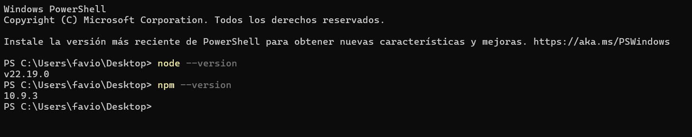
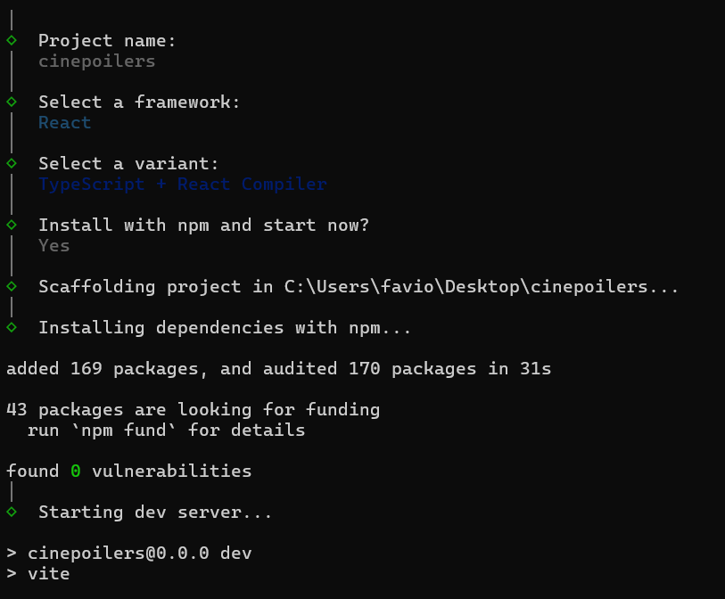
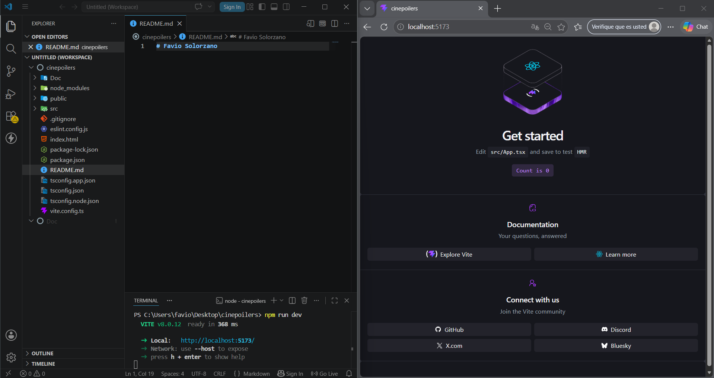
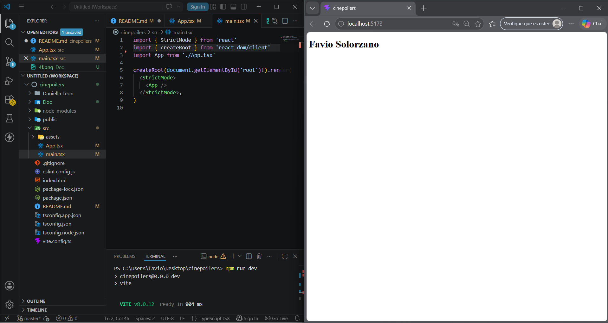
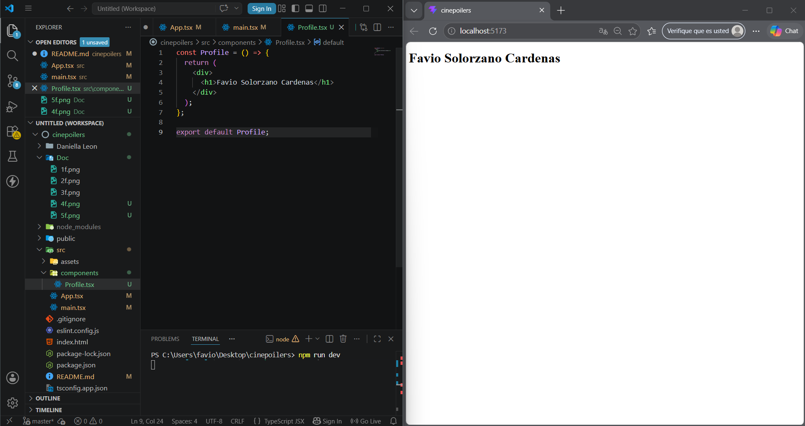

# Favio Solorzano 

## Verificación del entorno 

## Preparación del entorno de trabajo 

## Levantamiento del trabajo 

## Editar el home de bienvenida 

## Limpiar el entorno de trabajo 

## La creación de otro componente 

# Daniella Micaela Leon Andres

## verificacion node

## instalacion del proyecto

## levantamiento del proyecto

## pagina editada

## App Limpia

## Creacion de Componente

